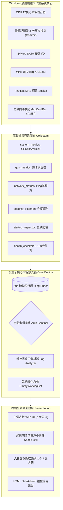

# 📓 PulseGuard PRO - 一個被「幽靈卡頓」逼瘋的工程師開發筆記

<div align="center">


<p align="center">
  <b>「電腦剛才明明卡了整整 3 秒，為什麼打開工作管理員時，兇手早就溜了？」</b><br>
  這是一份為了解開 Windows 神秘卡頓、對決微軟防毒 780% CPU 狂飆、以及打造極致黑盒子遙測系統的<b>實戰踩坑紀錄與工具手冊</b>。
</p>

</div>

---

## 📖 開發緣起：那個抓不到兇手的下午

相信每一位 Windows 使用者都經歷過這種痛苦：
- 🎮 **打遊戲打到關鍵會戰**：畫面突然凍結 2 秒，下一刻直接看黑白畫面；
- 💻 **寫程式打字、剪輯影片**：滑鼠指針突然像陷進泥沼一樣嚴重掉幀；
- 😤 **氣急敗壞按下 `Ctrl + Alt + Del`**：打開工作管理員時，CPU 卻悠哉地躺在 5%，一切風平浪靜，根本找不到剛才到底是誰在搞鬼！

> **痛點本質**：  
> Windows 內建的工作管理員永遠只能告訴你**「現在」**發生了什麼，卻從來無法告訴你**「剛才卡頓的那一瞬間」**到底發生了什麼。

為了徹底終結這場猜忌，我決定自己動手寫一個**電腦專屬的「飛行黑盒子」與自動抓兇哨兵**——讓每一次莫名其妙的瞬間暴衝都無所遁形。

---

## 🗺️ 專案開發全景地圖 (Development & Architecture Map)

### 1. 系統資料流與全景拓撲圖 (System Topology)



### 2. 功能模組演進路線圖 (Feature Roadmap)

| 版本階段 | 里程碑主題 | 核心突破與功能演進 | 狀態 |
| :--- | :--- | :--- | :---: |
| **v1.0** | 🐣 **黑盒子雛形與遙測基石** | 60 秒滾動飛行緩衝環 (Ring Buffer)、高頻硬體遙測、純圓形透明置頂懸浮球 | `✅ 已完成` |
| **v1.5** | 🤖 **自動哨兵與大白話診斷** | 瞬間卡頓自動拍照存證 (Sentinel)、防刷屏智能聚合、微軟防毒 780% CPU 暴衝排解指引 | `✅ 已完成` |
| **v2.0** | 🛡️ **微軟原廠防毒與惡意獵殺** | 聯動微軟原生 `MpCmdRun.exe` 核心、偽裝 svchost 木馬獵殺、礦池特徵排查、Hosts 劫持體檢 | `✅ 已完成` |
| **v2.5** | 🌐 **網路爆 Ping 與頻寬獵手** | 毫秒級無感 Socket RTT 延遲探針、即時上下行頻寬計算、60秒青色延遲動態波形流 | `✅ 已完成` |
| **v3.0** | 🎮 **遊戲狂暴免打擾模式** | 一鍵掛起微軟更新與排程掃描、前台遊戲/軟體 CPU 優先權自動拉升、免打擾極速環境 | `🚧 規劃中` |
| **v3.1** | 🌡️ **硬體縮缸與過熱降頻警報** | 捕捉 CPU PROCHOT 硬體降頻、筆記型電腦高溫降頻警報、散熱改善建議 | `🚧 規劃中` |
| **v3.2** | 💾 **SSD S.M.A.R.T. 壽命守護** | NVMe / SATA 固態硬碟剩餘壽命百分比、總寫入量 (TBW) 監控與壞軌卡死提早預警 | `🚧 規劃中` |
| **v3.3** | 🪟 **懸浮球懸停卡片 (Mini HUD)** | 滑鼠懸停展開毛玻璃資訊小卡（CPU/RAM/GPU溫/網速），移開自動縮回純圓球 | `🚧 規劃中` |

---

## 🛠️ 架構設計與工程踩坑實錄 (Dev Log)

### 踩坑 1：不能為了解決卡頓，自己反而成了卡頓兇手（滾動飛行環 Ring Buffer）
* **挑戰**：如果每秒把全系統所有的 CPU、記憶體、磁碟讀寫寫入硬碟或資料庫，頻繁的磁碟 I/O 本身就會變成電腦卡頓的元兇。
* **解法**：在 [`core/flight_recorder.py`](file:///core/flight_recorder.py) 中設計了執行緒安全的 `Rolling Ring Buffer`（滾動緩衝環）。所有遙測指標全數常駐在極小的記憶體環中，僅保留最近 60 秒的精細切片。按下 <kbd>Space</kbd> 空白鍵時，0.01 秒瞬間回溯峰值並計算加權衝擊力，零硬碟負擔。

### 踩坑 2：對決微軟防毒！為什麼 `MsMpEng.exe` 能吃滿 783.5% CPU？
* **靈異現象**：在 12 核心的高效能電腦上，卡頓哨兵連續拍下 `MsMpEng.exe` 吃滿 783.5% CPU，甚至手動到設定把「即時防護」關掉後，它依然在背景瘋狂飆車！
* **真相反思**：
  1. `783.5%` 不是 Bug：因為是 12 核心處理器（總容量 1200%），微軟防毒一口氣霸佔了整整 8 個核心在全速狂飆。
  2. 為什麼 Windows 安全性寫「上次掃描是昨天」？因為那是**手動掃描紀錄**；微軟在背後偷偷啟動的是**「系統自動維護排程 (Scheduled Scan)」**，在圖形介面上完全沒有任何進度條。
  3. 為什麼外部按鈕殺不掉它？因為微軟給自家防毒上了 Protected Process Light (PPL) 與防篡改保護，外部程式無權強制關閉。
* **最終解法（寫進大白話結論）**：
  在自動哨兵結論卡片中加入親切好懂的處方籤——教使用者如何透過 <kbd>Ctrl</kbd> + <kbd>Alt</kbd> + <kbd>Del</kbd> 工作管理員調降其優先順序，並將工作目錄加入排除清單，徹底根治防毒與開發工具互咬。

### 踩坑 3：極度挑剔的桌面懸浮球——如何做出「真正置頂、純透明無框小圓球」？
* **痛點**：許多第三方懸浮球在全螢幕切換視窗時就會被壓在底下，或者四周帶著難看的白色方塊邊框。
* **解法**：在 [`floating_ball.py`](file:///floating_ball.py) 中，使用 Windows 原生 `ctypes` 呼叫底層 API：
  - `SetWindowPos` 綁定 `HWND_TOPMOST`，實現真正的「最高層級全域置頂」；
  - 利用 `-transparentcolor` 色彩穿透技術，打造 100% 透明無方框的極簡圓形視覺；
  - 內建硬體 API Fallback，即使後端伺服器沒開，小圓球依然能精準顯示本機 RAM 百分比，左鍵一按立即釋放記憶體。

### 踩坑 4：防毒安全中心——惡意挖礦與記憶體偽裝行程獵殺
* **巧思**：不單單依靠微軟原生掃描引擎，在 [`collectors/security_scanner.py`](file:///collectors/security_scanner.py) 增加了主動式特徵防禦：
  - 獵殺偽裝成 `svchost.exe`、`csrss.exe` 但實際路徑不在 `System32` 核心目錄下的木馬程序；
  - 檢測連接 `stratum+tcp` 礦池協議或含有 `xmrig` 關鍵字的偷挖礦程式；
  - 即時審查系統 `hosts` 檔案是否遭到惡意劫持或重定向。

### 踩坑 5：誰說卡頓一定是硬體？——網路爆 Ping 與偷跑頻寬獵手
* **痛點**：很多時候電腦「卡」不是 CPU 滿載，而是線上遊戲突然爆 Ping 瞬移、通話破音或網頁轉圈，而背後往往是某個程式在偷偷霸佔頻寬。
* **解法**：在 [`collectors/network_metrics.py`](file:///collectors/network_metrics.py) 設計了高頻無感 Socket RTT 握手遙測：
  - 毫秒級精度追蹤連線延遲（Ping），並在 60 秒即時負載流繪製青色波形；
  - 即時計算下載/上傳頻寬（MB/s），自動揪出誰在背後偷偷吃滿頻寬；
  - 一旦延遲突破臨界值，自動哨兵立即拍照記錄並給予一鍵 FlushDNS 與排解處方！

### 踩坑 6：前端防崩哲學——歷史舊資料相容與瀏覽器快取破除 (Cache Busting)
* **痛點**：在功能高速升級時（例如引入網路爆 Ping 與新欄位），使用者重新整理後偶爾會看見「載入哨兵日誌失敗」的錯誤。
* **深層病因**：
  1. **瀏覽器頑固的磁碟快取 (Disk Cache)**：Chrome 在普通重新整理時，經常依然讀取記憶體中快取的舊版 JS 腳本；
  2. **歷史舊資料與新資料結構摩擦**：在架構升級前捕捉到的舊卡頓事件，缺少了新模組所需要的特定欄位，導致前端在遍歷時觸發型別或未定義錯誤。
* **解法（四重端到端防禦）**：
  - **版本戳記破快取 (Cache Busting)**：在 [`static/index.html`](file:///static/index.html) 引入腳本時加上版本查詢字串 `<script src="app.js?v=2.6.0"></script>`，強迫瀏覽器丟棄舊快取；
  - **極致防禦性渲染 (Defensive Rendering)**：前端對所有外部傳入的 API 資料實施嚴格的 `Array.isArray()` 型別檢查與安全回退（`inc.reason || '系統高壓'`），即便歷史紀錄格式有差異也 100% 絕不崩潰；
  - **後端安全降級 (Graceful Degradation)**：在 [`server/handlers.py`](file:///server/handlers.py) 與 [`core/sentinel.py`](file:///core/sentinel.py) 中全數採用 `.get()` 安全存取與例外兜底，確保端到端絕對穩定。

---

## 🌟 核心特色模組全覽

| 模組分頁 | 功能名稱 | 核心價值與解決的痛點 |
| :--- | :--- | :--- |
| **Tab 1: 即時監控** | 📊 **即時監控儀表 (Live Telemetry)** | 雙曲線即時波形流，全方位監測 CPU 總體與 12 核心、實體 RAM、Commit、C 槽、GPU 溫控與**【網路延遲爆 Ping / 上下行頻寬獵手】**。快捷鍵 <kbd>1</kbd>。 |
| **Tab 2: 黑盒子** | 🚨 **頓挫黑盒子分析 (Lag Hunter)** | 回溯過去 60 秒硬體高峰，秒抓是哪一個軟體突然暴衝吃光資源。快捷鍵 <kbd>Space</kbd> 隨時觸發。 |
| **Tab 3: 自動哨兵** | 🤖 **自動卡頓哨兵 (Auto Sentinel)** | 背景自動值守，一旦出現凍結自動拍照存證；並附帶**大白話診斷結論與解決步驟**。快捷鍵 <kbd>3</kbd>。 |
| **Tab 4: 垃圾清理** | 🧹 **深度快取清道夫 (Deep Cleaner)** | 掃描並清除 Windows Update 更新殘留包、Chrome/Edge 快取、縮圖快取與臨時暫存檔。快捷鍵 <kbd>4</kbd>。 |
| **Tab 5: 全機體檢** | 🩺 **全機深度體檢 (Health Check)** | 0-100 全機健康評分，揪出 C 槽剩餘空間不足、開機過長或虛擬記憶體膨脹等弱點。快捷鍵 <kbd>5</kbd>。 |
| **Tab 6: 開機管理** | 🚀 **常駐啟動清道夫 (Startup Inspector)** | 掃描註冊表開機自啟項目，標註高負載軟體並給予禁用調校建議。快捷鍵 <kbd>6</kbd>。 |
| **Tab 7: 防毒中心** | 🛡️ **微軟原生防毒與惡意獵殺中心** | 聯動微軟原生 `MpCmdRun.exe` 核心（快速/完整掃描）、挖礦木馬獵殺與單檔 SHA256 驗證。快捷鍵 <kbd>7</kbd>。 |

---

## ⌨️ 全域快捷鍵圖鑑

在儀表板網頁中，按鍵即享極致操控：

| 快捷鍵 | 對應動作 |
| :---: | :--- |
| <kbd>Space</kbd> | 隨時觸發**「抓出剛才卡頓兇手」**並進行 60 秒深度黑盒子分析 |
| <kbd>R</kbd> | 隨時執行**「一鍵急救減負」**（強制修剪釋放閒置 RAM 與清空臨時暫存） |
| <kbd>1</kbd> | 切換至 **即時監控儀表**（CPU / RAM / Commit / C槽 / GPU 溫度） |
| <kbd>2</kbd> | 切換至 **頓挫黑盒子分析**（抓出瞬間暴衝兇手） |
| <kbd>3</kbd> | 切換至 **自動卡頓哨兵事件簿**（含智慧診斷結論與排解指引） |
| <kbd>4</kbd> | 切換至 **深度垃圾清道夫**（清除系統更新殘留與瀏覽器快取） |
| <kbd>5</kbd> | 切換至 **全機深度體檢**（0-100 健康評分與扣分弱點） |
| <kbd>6</kbd> | 切換至 **常駐啟動清道夫**（分析拖慢開機速度的軟體） |
| <kbd>7</kbd> | 切換至 **防毒安全中心**（Defender 快速/完整掃描、特徵驗證與威脅獵殺） |

---

## 💡 常見問題與卡頓排解 (FAQ & Troubleshooting)

### Q：自動卡頓哨兵一直抓到 `MsMpEng.exe` 吃滿 CPU（甚至數百 %），該怎麼解決？

> **【為什麼會發生？】**  
> `MsMpEng.exe` 是 Windows Defender 內建防毒的核心進程。微軟會在背景發起「系統自動排程維護」或與頻繁讀寫檔案的軟體（如程式碼編輯器、Python 專案、ComfyUI 模型暫存）互相拉扯，導致防毒瞬間調用多個 CPU 核心（在多核心電腦上加總可達 100% ~ 800%+），造成畫面嚴重掉幀或卡死。

#### 🛠️ 解決方法 A：使用【Ctrl + Alt + Del】工作管理員手動降速／中止（最速應急）
1. **打開工作管理員**：同時按下鍵盤 <kbd>Ctrl</kbd> + <kbd>Alt</kbd> + <kbd>Del</kbd>（或直接按 <kbd>Ctrl</kbd> + <kbd>Shift</kbd> + <kbd>Esc</kbd>），點選進入**【工作管理員】**。
2. **找出高負載防毒進程**：在「處理程序」列表中，點擊「CPU」欄位由大到小排序，找到佔用最高的 **Antimalware Service Executable** (`MsMpEng.exe`) 或其他第三方防毒軟體。
3. **終止或降低優先順序**：
   - 在該程序上點擊滑鼠右鍵，選擇**【結束工作】**。
   - 若因 Windows 底層防篡改保護無法直接結束，請切換至**【詳細資料】**頁籤，找到 `MsMpEng.exe` 點擊滑鼠右鍵 ➔ **【設定優先順序】** 改為**「低」**，立即將 100% 處理器算力釋放還給目前操作的視窗！

#### 🌟 解決方法 B：將專案目錄加入「排除清單」（一勞永逸，徹底根治）
1. 打開 Windows「設定」➔「更新與安全性」➔**【Windows 安全性】**（或直接在工作列搜尋「Windows 安全性」）。
2. 點擊進入**【病毒與威脅防護】**。
3. 在「病毒與威脅防護設定」段落下，點擊藍色文字**【管理設定】**。
4. 頁面滾動到最下方，找到「排除項目」，點擊**【新增或移除排除項目】**。
5. 點擊**【＋ 新增排除項目】**：
   - 選擇**「資料夾」**：將常有大量暫存檔或程式碼讀寫的專案目錄加入。
   - 選擇**「處理程序」**：輸入 `python.exe`。
6. 加入後，微軟防毒便永遠不會再次死磕這些檔案，從此徹底杜絕突發性 100% 卡頓！

---

## 🛠️ 安裝與啟動使用

### 方式 1：一鍵點擊執行 (最推薦)
直接在專案資料夾中雙擊執行：
```text
start.bat
```
腳本會自動檢查 Python 環境，並在預設瀏覽器中開啟診斷面板 (`http://localhost:8899`)。

### 方式 2：使用終端機執行
```bash
# 1. 建議安裝可選加速模組 (大幅提升高頻遙測效能)
pip install psutil

# 2. 啟動伺服器
python app.py
```

### 方式 3：單獨開啟桌面置頂懸浮小圓球
雙擊執行：
```text
run_floating_ball.bat
```
會在螢幕右上角常駐純透明圓形小球：
- **左鍵點擊小球**：立即執行急救釋放 RAM。
- **右鍵點擊小球**：可選擇「抓出剛才卡頓兇手」或「微軟快速查毒」。

---

## 🔒 隱私與安全保證

- **100% 本地運作**：所有遙測、行程分析、防毒指令均在您的電腦本機執行，絕不將任何數據或檔案上傳到外部伺服器。
- **無後門、無外部廣告**：純原生 Python + Windows 原生 API 打造，保護您的系統隱私與資源純淨。

---

## 📄 開源授權

本專案採用 [MIT License](LICENSE) 條款開源授權。歡迎自由 Fork、提交 PR 或提出 Issue 一起完善它！
